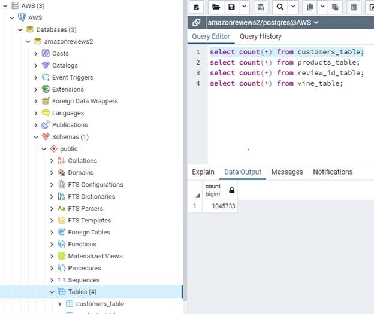
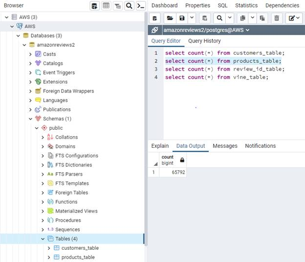
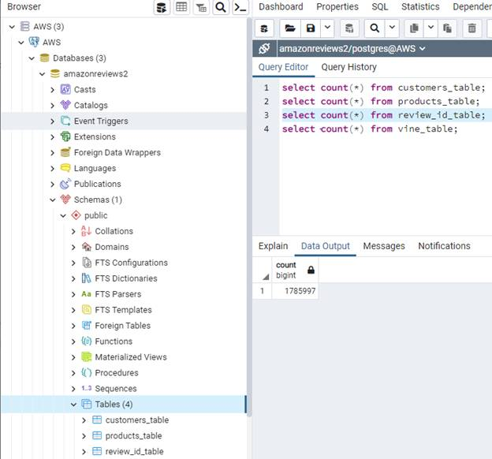
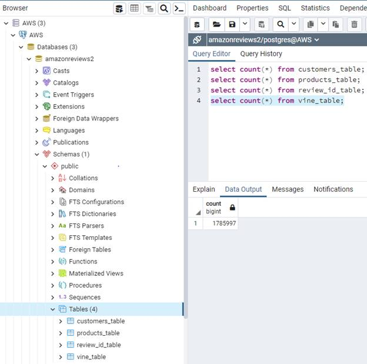
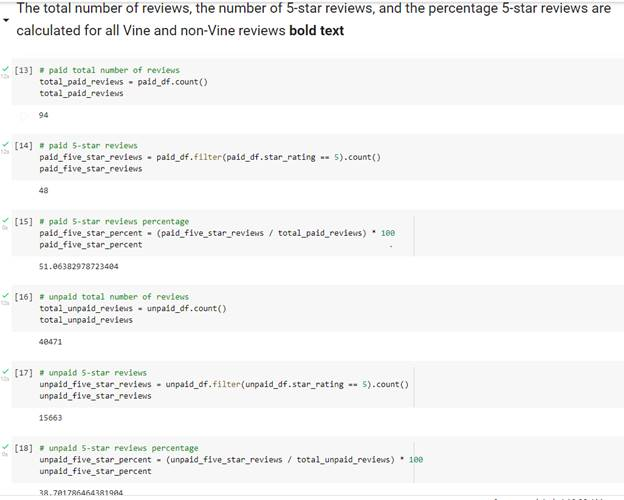

## Overview

The purpose of this project is to analyze Amazon reviews written by members of the paid **Amazon Vine program**. This is a service that allows manufacturers and publishers obtain reviews of their products and inspect for  any biases between **Vine** members and **Non-Vine** member's reviews.

In order to determine if there is any bias towards favorable reviews from Vine members vs. non-members, we need to identify the percentage of 5 star ratings to total rating.  I have used:

- `PySpark` to extract the dataset, transform the data, connect to `AWS RDS` instance and load the transformed data into `pgAdmin`.
- `Google Colaboratory` to import `PySpark` libraries and connect to `Postgres` in order to create `SQL` tables and export the results.

I chose to analyze reviews that were made by users in the **"Video"** category.

Dataset used for this analysis can be found below 

https://s3.amazonaws.com/amazon-reviews-pds/tsv/amazon_reviews_us_Video_Games_v1_00.tsv.gz

.Resources

- Data Source: [Amazon Review datasets](https://s3.amazonaws.com/amazon-reviews-pds/tsv/index.txt), [Video Games Review dataset](https://s3.amazonaws.com/amazon-reviews-pds/tsv/amazon_reviews_us_Video_Games_v1_00.tsv.gz)
- Software: Google Colab Notebook, PostgreSQL 12.x pgAdmin 4, AWS

## **Results**

The data  listed below is documentation of the tables and their data created in pgAdmin

- How many Vine reviews and non-Vine reviews were there?

  Vine Reviews were -  94

  Non-Vine Reviews were - 40471

  

- How many Vine reviews were 5 stars? How many non-Vine reviews were 5 stars?

  Vine Reviews (5 stars) were - 48

  Non-Vine reviews (5 stars) were - 15663

- What percentage of Vine reviews were 5 stars? What percentage of non-Vine reviews were 5 stars?

  percent of Vine reviews (5 stars) - 51%

  percent of non vine (5 stars) - 38.7%

The next set of data contains the total review analysis

|  |
| -------------------------------------------- |
|  |
|  |
|  |
|                                              |
| Total Number of Reviews                      |
|  |
|                                              |

## Summary 

51% of the reviews in the Vine program were 5 stars reviews whereas the percentage in the non-Vine reviews is only 39%. This describes a positivity bias for reviews in the Vine program.
Additionally we could analyze the statistical distribution (mean, median and mode) of the star rating for the Vine and non-Vine reviews.
